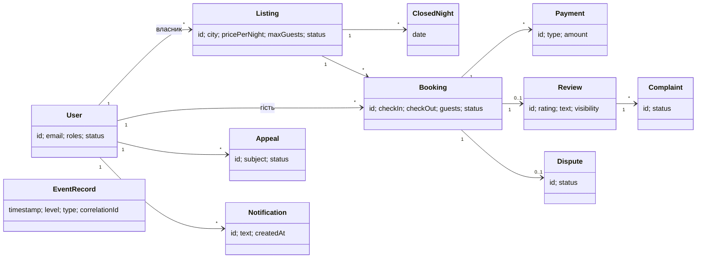

# Модель ресурсів REST API «rental-is»

Джерело вимог: SRS v1.1 (ADD-01), тег `spec-v1.1`; терміни — `spec/glossary.md`.
Контракт: `api/openapi.yaml`. Простежуваність: `docs/api-traceability.md`.

## 1. Вимоги, доступні через API

SRS §5.2 віддає внутрішній програмний інтерфейс етапу проєктування; він має
забезпечувати поведінку й коди відмов розділу 3. Не кожна функціональна
вимога дає окрему операцію:

| Група | Вимоги | Як представлені в API |
|---|---|---|
| Власні операції | FR-01, FR-02, FR-03, FR-04, FR-05, FR-06, FR-09, FR-12, FR-13, FR-17, FR-18, FR-19, FR-20, FR-21, FR-22, FR-23 | окремі операції (розділ 4) |
| Правила всередині операцій | FR-07, FR-08, FR-15 | FR-07 і FR-08 — перевірки й коди відмов операції створення запиту; FR-15 — суми в Booking і платіжних операціях |
| Автоматичні дії системи | FR-10, FR-11, FR-14, FR-16 | операцій немає: дію виконує система, а не клієнт; результат видно через читання бронювання, оголошення і платіжних операцій |

Операція на кшталт «завершити бронювання» для FR-11 дала б клієнту
можливість, яку SRS віддає системі, тому такі операції не вводяться.

Нефункціональні вимоги, що впливають на контракт:

| Вимога | Вплив на API |
|---|---|
| NFR-01 | одночасні підтвердження несумісних запитів: успішне лише одне, решта — відмова |
| NFR-06 | журнал подій лише читається: операцій зміни й видалення записів немає |
| NFR-07 | ночі — дати `YYYY-MM-DD`; моменти — дата й час зі зсувом (Europe/Kyiv); записи журналу — UTC |
| NFR-09 | суми — UAH з точністю 0,01, передаються рядком; зовнішнього платіжного провайдера немає |
| NFR-10 | параметри платформи й облікові записи модераторів не змінюються через API |
| NFR-11 | пароль лише в запиті входу й реєстрації; у відповідях не повертається ніколи |

NFR-02…NFR-05 і NFR-08 стосуються процесу розробки, продуктивності та
інтерфейсу користувача і на контракт не впливають.

## 2. Ресурси

| Ресурс (термін глосарію) | Ідентифікатор у коді | URI |
|---|---|---|
| Обліковий запис | `User` | `/users`, `/users/me` |
| Сесія входу | — | `/auth/session` |
| Оголошення (житло) | `Listing` | `/listings`, `/listings/{listingId}` |
| Ніч, закрита власником | `ClosedNight` | `/listings/{listingId}/closed-nights/{date}` |
| Бронювання | `Booking` | `/bookings`, `/bookings/{bookingId}` |
| Платіжна операція | `Payment` | `/bookings/{bookingId}/payments` |
| Відгук | `Review` | `/listings/{listingId}/reviews`, `/reviews/{reviewId}` |
| Скарга на відгук | — | `/reviews/{reviewId}/complaints`, `/complaints/{complaintId}` |
| Спір щодо скасування | `Dispute` | `/bookings/{bookingId}/disputes`, `/disputes/{disputeId}` |
| Оскарження | `Appeal` | `/appeals`, `/appeals/{appealId}` |
| Запис журналу подій | — | `/events` |
| Повідомлення | `Notification` | `/notifications` |

Терміни, яких слід уникати (глосарій, розділ 2), в іменах ресурсів і полів
не вживаються: немає `deposit` («застава») і `bookingPrice` («вартість
бронювання»).

## 3. Правила URI і методів

1. **Колекції — іменник у множині**: `/listings`, `/bookings`, `/disputes`.
2. **Методи за семантикою HTTP.** `GET` — читання без побічних ефектів;
   `POST` на колекцію — створення; `PUT` — повна заміна редагованого
   ресурсу (картка житла, відгук) або ідемпотентне встановлення (закрити
   ніч); `DELETE` — лише скасування встановленого (відкрити ніч). Видалення
   відгуків, бронювань і записів журналу немає (FR-17, FR-18, NFR-06).
3. **Переходи станів і рішення — `POST /{ресурс}/{id}/{дія}`**: `confirm`,
   `reject`, `cancel`, `publish`, `unpublish`, `block`, `decision`, а не
   `PATCH` поля `status`. Підтвердження (FR-09) створює платіжні операції й
   автоматично відхиляє несумісні запити; `PATCH {"status": "CONFIRMED"}`
   ховав би ці наслідки й дозволяв би клієнту записати довільний статус.
4. **Вкладеність — не глибше одного рівня.** Ресурс, що створюється щодо
   іншого (відгук і спір — щодо бронювання, скарга — щодо відгуку, закрита
   ніч — житла), створюється вкладеним запитом; далі читається й
   обробляється за власним ідентифікатором на верхньому рівні.
5. **Ідентифікатори — непрозорі рядки (UUID)**, не порядкові номери;
   дата ночі в шляху — `YYYY-MM-DD`.
6. **Пошук і фільтри — параметри `GET` колекції** (`/listings?city=…`,
   `/bookings?role=guest`), без окремих `/search`.
7. **Перелік звернень** (ADD-01, K-317) — `GET /complaints`, `/disputes`,
   `/appeals` з `status=open`. Це не черга завдань модератора (K-139):
   призначення виконавця, пріоритетів і обов'язковості розгляду немає.

## 4. Операції

| № | Метод | URI | Операція | Хто | REQ-ID |
|---|---|---|---|---|---|
| 1 | POST | `/users` | Реєстрація | незареєстрований | FR-01 |
| 2 | GET | `/users/me` | Власний обліковий запис | після входу | FR-01 |
| 3 | POST | `/auth/session` | Вхід | незареєстрований | FR-01, NFR-11 |
| 4 | DELETE | `/auth/session` | Вихід | після входу | FR-01 |
| 5 | GET | `/listings` | Пошук житла | будь-хто | FR-05 |
| 6 | POST | `/listings` | Створення картки житла | користувач | FR-02 |
| 7 | GET | `/listings/{listingId}` | Картка житла | будь-хто | FR-02 |
| 8 | PUT | `/listings/{listingId}` | Редагування картки | власник | FR-02 |
| 9 | POST | `/listings/{listingId}/unpublish` | Зняття з публікації | модератор | FR-04 |
| 10 | POST | `/listings/{listingId}/publish` | Повернення в публікацію | модератор | FR-04 |
| 11 | GET | `/listings/{listingId}/closed-nights` | Закриті ночі | власник | FR-03 |
| 12 | PUT | `/listings/{listingId}/closed-nights/{date}` | Закрити ніч | власник | FR-03 |
| 13 | DELETE | `/listings/{listingId}/closed-nights/{date}` | Відкрити ніч | власник | FR-03 |
| 14 | POST | `/bookings` | Створення запиту на бронювання | гість | FR-06, FR-07, FR-08, FR-15 |
| 15 | GET | `/bookings?role=guest\|owner` | Мої поїздки / бронювання власника | гість, власник | FR-12 |
| 16 | GET | `/bookings/{bookingId}` | Деталі бронювання | гість, власник | FR-12 |
| 17 | POST | `/bookings/{bookingId}/confirm` | Підтвердження | власник | FR-09, NFR-01 |
| 18 | POST | `/bookings/{bookingId}/reject` | Відхилення | власник | FR-09 |
| 19 | POST | `/bookings/{bookingId}/cancel` | Скасування | гість, власник | FR-13 |
| 20 | GET | `/bookings/{bookingId}/payments` | Платіжні операції | гість, власник | FR-15, FR-16 |
| 21 | POST | `/bookings/{bookingId}/reviews` | Залишити відгук | гість | FR-17 |
| 22 | PUT | `/reviews/{reviewId}` | Редагувати відгук (24 год) | автор | FR-17 |
| 23 | GET | `/listings/{listingId}/reviews` | Відгуки про житло | будь-хто | FR-18 |
| 24 | POST | `/reviews/{reviewId}/complaints` | Скарга на відгук | власник житла | FR-18 |
| 25 | GET | `/complaints?status=open` | Перелік скарг | модератор | FR-18 (ADD-01) |
| 26 | POST | `/complaints/{complaintId}/decision` | Рішення за скаргою | модератор | FR-18 |
| 27 | POST | `/bookings/{bookingId}/disputes` | Спір щодо скасування | гість | FR-20 |
| 28 | GET | `/disputes?status=open` | Перелік спорів | модератор | FR-20 (ADD-01) |
| 29 | POST | `/disputes/{disputeId}/decision` | Рішення у спорі | модератор | FR-20 |
| 30 | POST | `/users/{userId}/block` | Блокування | модератор | FR-19 |
| 31 | POST | `/appeals` | Оскарження блокування або зняття | заблокований, власник | FR-21 |
| 32 | GET | `/appeals?status=open` | Перелік оскаржень | модератор | FR-21 (ADD-01) |
| 33 | POST | `/appeals/{appealId}/decision` | Рішення за оскарженням | модератор | FR-21 |
| 34 | GET | `/events` | Журнал подій | за роллю | FR-22, NFR-06 |
| 35 | GET | `/notifications` | Повідомлення | після входу | FR-23 |

Операцій розблокування немає: розблокування — лише наслідок задоволеного
оскарження (FR-21). Операцій зміни параметрів платформи і створення
модераторів немає (NFR-10).

## 5. Модель помилок

Усі відповіді з кодом 4xx і 5xx мають `Content-Type: application/problem+json`
і одну схему `Problem` (RFC 9457) з полями `type`, `title`, `status`, `code`,
`detail`, `correlationId`. `correlationId` збігається з наскрізним
ідентифікатором операції в записі журналу подій (FR-22), тож відмову в API
можна знайти в журналі. Для DATES_UNAVAILABLE додається
`conflictingBookingIds` — ідентифікатори бронювань, з якими виник конфлікт
(K-110).

Перелік кодів закритий: інших кодів API не повертає.

| Код | HTTP | Джерело | Коли |
|---|---|---|---|
| `MIN_NIGHTS` | 422 | FR-07 | кількість ночей менша за 1 |
| `GUESTS_OUT_OF_RANGE` | 422 | FR-07 | кількість осіб поза межами житла |
| `CHECKIN_TOO_SOON` | 422 | FR-07 | до моменту заїзду менше 1 год або дата минула |
| `OWN_LISTING` | 403 | FR-07 | гість є власником житла |
| `ACCOUNT_BLOCKED` | 403 | FR-01, FR-07 | дія заблокованого користувача |
| `LISTING_UNPUBLISHED` | 409 | FR-07 | житло в стані Unpublished |
| `DATES_UNAVAILABLE` | 409 | FR-07, FR-08 | діапазон не проходить повну перевірку доступності |
| `PHOTO_INVALID` | 422 | FR-02 (ADD-01) | порушення вимог до фотографій |
| `INVALID_CREDENTIALS` | 401 | FR-01 | неправильні email або пароль |
| `LOGIN_RESTRICTED` | 429 | NFR-11 | тимчасове обмеження входу після 5 невдалих спроб |
| `EMAIL_TAKEN` | 409 | FR-01 | email уже використовується (AC-01.1) |
| `UNAUTHENTICATED` | 401 | загальний | дія потребує входу (AC-01.4) |
| `FORBIDDEN` | 403 | загальний | дія не дозволена цій ролі або над чужим ресурсом |
| `NOT_FOUND` | 404 | загальний | ресурсу немає або його не можна бачити |
| `VALIDATION_FAILED` | 422 | загальний | запит порушує схему: формат, межі полів |
| `STATE_CONFLICT` | 409 | загальний | дія неможлива в поточному стані або після спливу строку |
| `INTERNAL_ERROR` | 500 | загальний | збій системи; лише `correlationId`, без деталей |

**Чому статуси саме такі.** 422 — запит неприйнятний сам по собі;
409 — конфлікт зі станом ресурсу; 403 — дію заборонено цьому користувачу.

**Загальні коди — не нова поведінка.** SRS визначає, що система відмовляє
(відгук після 14 діб, скасування після моменту заїзду, повторне
оскарження), але не дає цим відмовам імені. Ім'я відмови — деталь
інтерфейсу, яку §5.2 віддає проєктуванню. Відмова там, де SRS її не
передбачає, була б новою поведінкою й оформлювалася б адендумом.

**Порядок перевірок FR-07 зберігається.** Повертається перший код, що
спрацював, і HTTP-статус визначає саме він: власник, який бронює своє зняте
з публікації житло, отримує `OWN_LISTING` (403), а не `LISTING_UNPUBLISHED`
(409) — AC-07.4.

**Конкурентні підтвердження (NFR-01).** Із двох одночасних підтверджень
несумісних запитів успішне лише одне; друге отримує `STATE_CONFLICT`, бо
його запит уже автоматично відхилено.

**Автентифікація.** Вхід (`POST /auth/session`) повертає токен; решта
операцій, крім читання оголошень, відгуків і пошуку, вимагає заголовка
`Authorization: Bearer <токен>`.