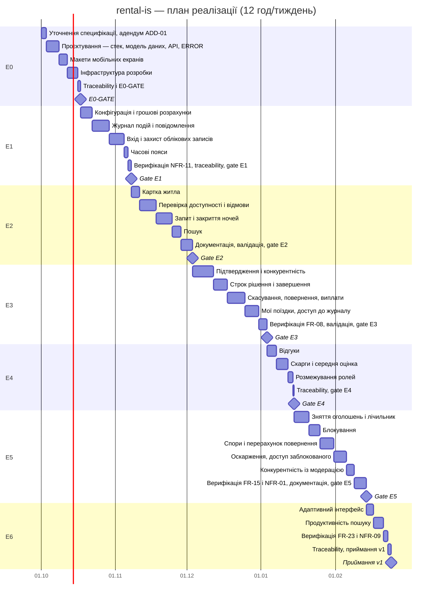

# План реалізації

План покриває всі вимоги SRS v1.0-baseline і адендуму ADD-01: 108 тікетів,
251 людино-година (реєстр — `docs/tickets.csv`). Його тривалість свідомо
більша за тривалість курсу.

**Обсяг реалізації в межах дисципліни:** етапи Е0 і Е1 — 64,5 людино-години,
≈5,4 тижня, до 2026-11-07. Е0 і Е1 — обов'язковий мінімум. Етапи Е2–Е6
лишаються затвердженим планом без реалізації в межах курсу.

Усі числа нижче пораховано скриптом `docs/scripts/plan_metrics.py` з
`docs/tickets.csv` (колонки «Етап», «Тип», «Виконавець», «Год», «Залежить
від»). Після зміни CSV розділи 1–4 оновлюються перезапуском скрипта.

## 1. Етапи

Старт — 2026-10-01; навантаження — 12 год на тиждень; етапи виконуються
послідовно: кожен починається після gate попереднього. Строк етапу — календарна
дата, до якої за цього навантаження вичерпується сукупна оцінка всіх етапів до
нього включно; вихідні окремо не враховуються. Ці самі строки задано як due
date milestones Е0…Е6 (`docs/scripts/create-issues.sh`).

| Етап | Зміст | Год | Наростаюче, тижнів | Початок | Строк | У межах курсу |
|---|---|---|---|---|---|---|
| Е0 | Уточнення специфікації й адендум ADD-01, проєктування, макети, інфраструктура розробки | 28 | 2,3 | 2026-10-01 | 2026-10-17 | так |
| Е1 | Конфігурація, грошові розрахунки, журнал подій, повідомлення, вхід і захист облікових записів, часові пояси | 36,5 | 5,4 | 2026-10-18 | 2026-11-07 | так |
| Е2 | Картка житла, перевірка доступності, відмови, запит, закриття ночей, пошук | 44 | 9,0 | 2026-11-08 | 2026-12-03 | ні |
| Е3 | Підтвердження, конкурентність, строки, завершення, скасування, повернення, виплати, мої поїздки | 53,5 | 13,5 | 2026-12-04 | 2027-01-03 | ні |
| Е4 | Відгуки, скарги, середня оцінка, розмежування ролей | 19,5 | 15,1 | 2027-01-04 | 2027-01-14 | ні |
| Е5 | Зняття оголошень, лічильник, блокування, спори, оскарження | 51,5 | 19,4 | 2027-01-15 | 2027-02-13 | ні |
| Е6 | Адаптивний інтерфейс, продуктивність пошуку, верифікація, приймання v1 | 18 | 20,9 | 2027-02-14 | 2027-02-24 | ні |
| **Разом** | | **251** | **20,9** | | | Е0 + Е1 = 64,5 год |

### Групи робіт

Групи — рівень деталізації діаграми Ганта. Кожен тікет належить рівно одній
групі; сума годин груп кожного етапу дорівнює годинам етапу (скрипт це
перевіряє).

| Етап | Група | Тікети | Год |
|---|---|---|---|
| Е0 | Уточнення специфікації, адендум ADD-01 | T-01, T-02, T-108 | 3,5 |
| Е0 | Проєктування — стек, модель даних, API, ERROR | T-03, T-04 | 9 |
| Е0 | Макети мобільних екранів | T-05 | 6 |
| Е0 | Інфраструктура розробки | T-06, T-07, T-08 | 7,5 |
| Е0 | Traceability і Е0-GATE | T-92, T-09 | 2 |
| Е1 | Конфігурація і грошові розрахунки | T-10, T-11, T-16, T-17 | 8,5 |
| Е1 | Журнал подій і повідомлення | T-12, T-13, T-14, T-15 | 12 |
| Е1 | Вхід і захист облікових записів | T-18, T-19, T-20, T-21 | 11 |
| Е1 | Часові пояси | T-22, T-23 | 2,5 |
| Е1 | Верифікація NFR-11, traceability, gate Е1 | T-93, T-94, T-24 | 2,5 |
| Е2 | Картка житла | T-25, T-26 | 6 |
| Е2 | Перевірка доступності і відмови | T-27, T-28, T-29, T-30 | 12 |
| Е2 | Запит і закриття ночей | T-31, T-32, T-33, T-34 | 11,5 |
| Е2 | Пошук | T-35, T-36 | 6 |
| Е2 | Документація, валідація, gate Е2 | T-95, T-96, T-97, T-98, T-37 | 8,5 |
| Е3 | Підтвердження і конкурентність | T-38, T-39, T-40, T-41 | 15 |
| Е3 | Строк рішення і завершення | T-42, T-43, T-44, T-45 | 10 |
| Е3 | Скасування, повернення, виплати | T-46, T-47, T-48, T-49, T-50, T-51 | 12,5 |
| Е3 | Мої поїздки, доступ до журналу | T-52, T-53, T-54, T-55 | 10 |
| Е3 | Верифікація FR-08, валідація, gate Е3 | T-99, T-100, T-101, T-56 | 6 |
| Е4 | Відгуки | T-57, T-58, T-59, T-60 | 6,5 |
| Е4 | Скарги і середня оцінка | T-61, T-62, T-63, T-64 | 8,5 |
| Е4 | Розмежування ролей | T-65, T-66 | 3,5 |
| Е4 | Traceability, gate Е4 | T-102, T-67 | 1 |
| Е5 | Зняття оголошень і лічильник | T-68, T-69, T-70, T-71 | 10,5 |
| Е5 | Блокування | T-72, T-73 | 8 |
| Е5 | Спори і перерахунок повернення | T-74, T-75, T-76, T-77 | 10 |
| Е5 | Оскарження, доступ заблокованого | T-78, T-79, T-80, T-81 | 9 |
| Е5 | Конкурентність із модерацією | T-82, T-83 | 5,5 |
| Е5 | Верифікація FR-15 і NFR-01, документація, gate Е5 | T-103, T-104, T-105, T-106, T-84 | 8,5 |
| Е6 | Адаптивний інтерфейс | T-85, T-86 | 5,5 |
| Е6 | Продуктивність пошуку | T-87, T-88 | 7 |
| Е6 | Верифікація FR-23 і NFR-09 | T-89, T-90 | 3 |
| Е6 | Traceability, приймання v1 | T-107, T-91 | 2,5 |

## 2. Діаграма Ганта

Тривалість групи в календарних годинах = години групи × 14: при 12 год роботи
на тиждень одна година роботи займає 168 / 12 = 14 календарних годин. Групи
виконуються послідовно, бо всі години оплачуються з одного бюджету — 12 год
студента на тиждень (розділ 4). Тому `after` кожної групи містить її логічні
попередники з колонки «Залежить від» і, якщо їх бракує, попередню групу як
ресурсну залежність. Логічні попередники кожної групи наведено в коментарі
`%%` над нею. Milestones gate збігаються зі строками етапів у розділі 1.

## 3. Критичний шлях

Мережа етапів: вершини — етапи Е0…Е6, тривалість D — сума годин тікетів
етапу; кожен етап залежить від gate попереднього. Прямий прохід:
ES = max(EF попередників), EF = ES + D. Зворотний прохід від фінішу
проєкту 251 год: LF = min(LS наступників), LS = LF − D. Резерв S = LS − ES.
Одиниця — години роботи; тижні = години / 12.

| Робота | Попередник | D | ES | EF | LS | LF | S | Критична |
|---|---|---|---|---|---|---|---|---|
| Е0 | — | 28 | 0 | 28 | 0 | 28 | 0 | так |
| Е1 | Е0 | 36,5 | 28 | 64,5 | 28 | 64,5 | 0 | так |
| Е2 | Е1 | 44 | 64,5 | 108,5 | 64,5 | 108,5 | 0 | так |
| Е3 | Е2 | 53,5 | 108,5 | 162 | 108,5 | 162 | 0 | так |
| Е4 | Е3 | 19,5 | 162 | 181,5 | 162 | 181,5 | 0 | так |
| Е5 | Е4 | 51,5 | 181,5 | 233 | 181,5 | 233 | 0 | так |
| Е6 | Е5 | 18 | 233 | 251 | 233 | 251 | 0 | так |

**Критичний шлях:** Е0 → Е1 → Е2 → Е3 → Е4 → Е5 → Е6 = 251 год = 20,9 тижня.

Мережа етапів — ланцюг: кожен етап починається лише після gate попереднього,
паралельних гілок немає. Тому всі етапи критичні, а резерв на рівні етапів
нульовий. Усередині етапів резерв є: логічні залежності між тікетами
допускають паралельну роботу. Найдовший ланцюжок залежностей усередині
кожного етапу:

| Етап | Сума годин | Найдовший ланцюжок, год | Ланцюжок |
|---|---|---|---|
| Е0 | 28 | 19 | T-01 → T-108 → T-03 → T-06 → T-07 → T-09 |
| Е1 | 36,5 | 19 | T-12 → T-13 → T-19 → T-20 → T-21 → T-93 → T-94 → T-24 |
| Е2 | 44 | 39 | T-25 → T-26 → T-27 → T-28 → T-29 → T-30 → T-31 → T-32 → T-33 → T-34 → T-35 → T-36 → T-96 → T-37 |
| Е3 | 53,5 | 25 | T-38 → T-39 → T-46 → T-47 → T-52 → T-53 → T-100 → T-56 |
| Е4 | 19,5 | 14,5 | T-57 → T-58 → T-61 → T-62 → T-63 → T-64 → T-102 → T-67 |
| Е5 | 51,5 | 24,5 | T-68 → T-69 → T-72 → T-73 → T-78 → T-79 → T-80 → T-81 → T-106 → T-84 |
| Е6 | 18 | 9,5 | T-87 → T-88 → T-107 → T-91 |
| **Разом** | **251** | **150,5** | |

Якби кількість виконавців не була обмежена, проєкт тривав би стільки, скільки
найдовший ланцюжок залежностей: 150,5 год, тобто 12,5 тижня при 12 год на
тиждень. Решту 100,5 год можна було б виконувати паралельно. Послідовними їх
робить лише те, що всі години оплачуються з одного бюджету.

## 4. Пропускна здатність людини

Критичний шлях охоплює всі етапи, тому на ньому лежать усі 251 год. Розподіл
за колонками «Тип» і «Виконавець»:

| Тип | human | both | agent | Разом |
|---|---|---|---|---|
| spec | 1,5 | 0 | 0 | 1,5 |
| gate | 5,5 | 0 | 0 | 5,5 |
| validation | 6 | 0 | 0 | 6 |
| verification | 0 | 11 | 0 | 11 |
| design | 6 | 9 | 0 | 15 |
| addendum | 0 | 2 | 0 | 2 |
| test | 0 | 72,5 | 0 | 72,5 |
| docs | 0 | 11,5 | 0 | 11,5 |
| chore | 0 | 0,5 | 7 | 7,5 |
| feature | 0 | 7 | 111,5 | 118,5 |
| **Разом** | **19** | **113,5** | **118,5** | **251** |

- **Дії людини в поіменованих категоріях.** spec, gate і validation разом
  дають 13 год (5,2 % плану). Verification — 11 год із виконавцем both. Частки
  людини в них `docs/tickets.csv` не містить, тож людська частина verification
  лежить у межах 0–11 год. Разом дії людини в цих категоріях — від 13 до
  24 год.
- **Людина за колонкою «Виконавець».** Мінімум — 19 год, лише тікети human
  (7,6 %), зокрема макети T-05. Максимум — 132,5 год, тобто human разом із
  усіма both (52,8 %), що становить 11,0 тижня при 12 год на тиждень.
- **Агент.** Лише тікети agent — 118,5 год (47,2 %), майже всі — feature.

### Висновок: що обмежує строк

1. **Залежності строк не обмежують.** Найдовший ланцюжок залежностей — 150,5 год
   (12,5 тижня), а план — 251 год (20,9 тижня). Різниця в 100,5 год — робота,
   яку залежності дозволяють робити паралельно.
2. **Строк обмежує пропускна здатність людини.** План рахує всі 251 год із
   бюджету студента — 12 год на тиждень, включно з 118,5 год тікетів agent.
   Тому строк дорівнює сумі годин, поділеній на 12. Він визначається
   бюджетом, а не мережею.
3. **Вузьке місце — не рішення людини.** spec, gate і validation займають
   лише 13 год. Найбільше людину завантажують тікети both, а серед них —
   тести: 72,5 год. За NFR-02 жоден feature не починається, доки його test не
   в Done. Отже, темп людини над тестами задає темп агента над реалізацією.
4. **Прогалина оцінки.** Робочий процес (`docs/workflow.md`) вимагає, щоб
   людина переглянула кожен тікет перед Done. Час цього перегляду в
   `docs/tickets.csv` окремо не оцінено. Тому з наявних даних не можна
   порахувати, скільки з 118,5 год тікетів agent насправді займає людину.
   Якщо майже нічого, навантаження людини не перевищує 132,5 год (11,0 тижня),
   і строк наближається до межі залежностей — 150,5 год. Щоб скоротити строк
   за рахунок агента, треба спершу окремо оцінити час перегляду.

## Коригування первинної декомпозиції

Первинну декомпозицію підготував кодинговий агент; її перевірив і скоригував
студент.

| № | Що запропонував агент | Дія студента | Підстава |
|---|---|---|---|
| 1 | Використано 4 типи тікетів із 8 (spec, test, feature, gate) і два не визначені в `docs/workflow.md` типи design* і chore* | Додано типи type:verification, type:validation, type:docs, type:addendum; design і chore легалізовано як повноправні типи; таблицю типів записано в `docs/workflow.md` | П. 3 методички вимагає всі вісім типів |
| 2 | Тікетів перевірки й валідації немає | Додано T-93, T-99, T-103, T-104 (type:verification) і T-96, T-100 (type:validation, виконавець лише human) | Без них неможливо виконати п. 7 методички про неделегування валідації агенту |
| 3 | Тікетів документації немає | Додано T-92, T-94, T-95, T-97, T-98, T-101, T-102, T-105, T-106, T-107 (type:docs): Reference Manual модулів availability і payments, README, підтримання `spec/traceability.csv` | Документація і матриця простежуваності є частиною плану |
| 4 | T-89 і T-90 мали тип test | Змінено на type:verification | Вони перевіряють уже реалізовану поведінку, а не передують їй |
| 5 | T-09 названо PLAN-GATE | Перейменовано на «Е0-GATE: готовність до реалізації» | PLAN-GATE — рішення лабораторної роботи, а не тікет усередині плану |
| 6 | Е2 первинної декомпозиції (тікети T-25…T-37) оцінено в 40 год замість фактичних 36 (арифметична помилка), звідки рамка курсу Е1 + Е2 ≈ 75 год | Рамку ≈75 год прийнято; після виправлення арифметики агентом і додавання тікетів Е2 = 44 год (36 + 8 за T-95…T-98), Е0 + Е1 + Е2 = 108,5 год; рамку курсу звужено до Е0 + Е1 — 64,5 год, ≈5,4 тижня | План покриває всі вимоги і свідомо довший за курс; у межах дисципліни виконуються Е0 і Е1 |
| 7 | Прогалини специфікації винесено в тікети type:spec T-01 і T-02 | T-01 і T-02 закрито рішеннями (OQ-04, OQ-05); замість прямої правки SRS створено тікет type:addendum T-108 «Адендум ADD-01» | П. 17 методички: нова функціональність оформлюється адендумом |

**Підсумок:** тікетів було 91, стало 108. Додано 17 (T-92…T-108). Змінено
10: T-09 — назва й залежності; T-89, T-90 — тип; T-03, T-24, T-37, T-56,
T-67, T-84, T-91 — лише залежності від доданих тікетів.

### Виправлення, внесені агентом

1. **Арифметика Е2.** У первинній декомпозиції агент оцінив Е2 у 40 год, хоча
   сума оцінок тікетів Е2 первинної декомпозиції (T-25…T-37) — 36 год. Це
   помилка агента, а не студента; агент виявив її сам, коли перевіряв суми в
   `docs/tickets.csv`. Через неї хибними були рамки ≈75 год і ≈84,5 год.
   Після коригувань до Е2 додано T-95…T-98 (8 год), тож чинна оцінка
   Е2 — 44 год (розділ 1).
2. **Назва адендуму.** Студент назвав адендум A-01; агент зауважив, що
   ідентифікатор A-01 уже зайнятий припущенням у SRS §2.4 (K-240). Адендум
   перейменовано на ADD-01 (K-328).
