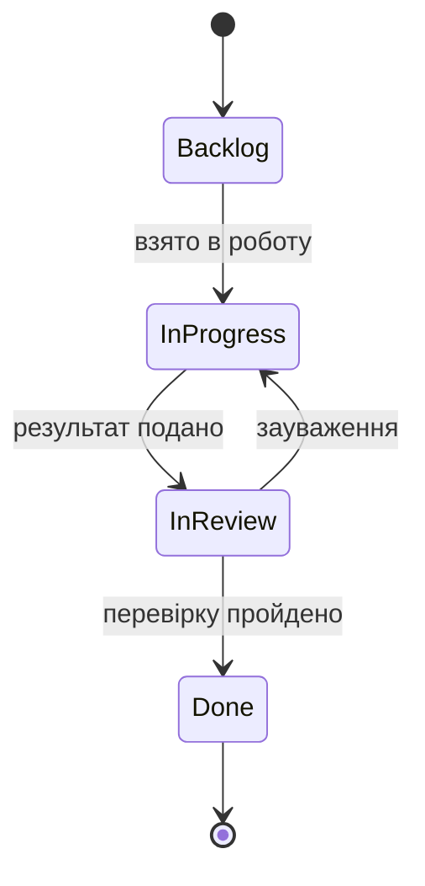

### Заборонені переходи

| Перехід | Чому заборонений |
|---|---|
| Backlog → Done | Робота не може бути завершена без перевірки людиною |
| Backlog → In review | Немає результату, який можна перевіряти |
| In review → Backlog | Зауваження повертають у In progress, контекст не втрачається |
| Done → будь-який | Закритий тікет не відкривається; потрібен новий |
| In progress для type:gate | Gate не виробляє результат: він або відкритий, або закритий рішенням GO/REVISE |
| In progress для type:feature, поки відповідний type:test не в Done | Порушує NFR-02: тест пишеться до реалізації |