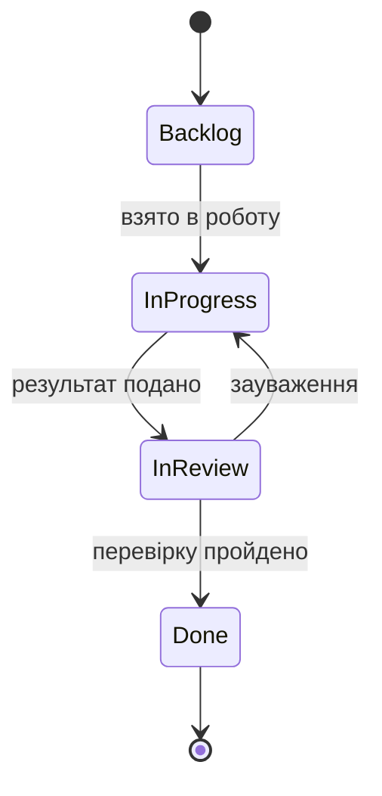

### Заборонені переходи

| Перехід | Чому заборонений |
|---|---|
| Backlog → Done | Робота не може бути завершена без перевірки людиною |
| Backlog → In review | Немає результату, який можна перевіряти |
| In review → Backlog | Зауваження повертають у In progress, контекст не втрачається |
| Done → будь-який | Закритий тікет не відкривається; потрібен новий |
| In progress для type:gate | Gate не виробляє результат: він або відкритий, або закритий рішенням GO/REVISE |
| In progress для type:feature, поки відповідний type:test не в Done | Порушує NFR-02: тест пишеться до реалізації |

### Типи тікетів

Тип задається міткою `type:<тип>`. Кожен тікет посилається щонайменше на
одну вимогу (FR-xx, NFR-xx) або критерій прийняття (AC-xx.n).

| Тип | Призначення | Результат |
|---|---|---|
| `type:spec` | Уточнення специфікації: прогалина або неоднозначність, яку не можна закрити без рішення людини | Відповідь людини, за потреби — зміна `spec/` через явний перегляд із фіксацією в журналі знань |
| `type:design` | Проєктне рішення, яке SRS свідомо залишає етапу проєктування: архітектура, модель даних, внутрішній API, макети | Документ у `docs/` |
| `type:chore` | Інфраструктура, конфігурація, інструменти розробки; поведінку системи не змінює | Зміни в структурі, конфігурації, скриптах |
| `type:test` | Модульний тест за критеріями прийняття, що не проходить до реалізації | Коміт `test:` і протокол прогону з тестом, що не проходить (NFR-02, NFR-03) |
| `type:feature` | Реалізація вимоги за критеріями прийняття | Коміт `feat:` і протокол прогону, де тести відповідного `type:test` проходять |
| `type:verification` | Перевірка вже реалізованої поведінки на відповідність повному набору критеріїв прийняття вимоги («чи правильно побудовано») | Звіт перевірки; знайдені дефекти виправляються комітами `fix:` |
| `type:validation` | Перевірка на реальних даних, що поведінка відповідає задуму `spec/idea.md`, а не лише критеріям («чи те побудовано»); виконує лише людина | Звіт валідації; розбіжності із задумом — нові тікети `type:spec` |
| `type:docs` | Документація: Reference Manual модулів, README, підтримання `spec/traceability.csv` | Коміт `docs:` |
| `type:gate` | Рішення контрольної точки: дозволити чи заборонити перехід до наступного етапу; код і тести не виробляє | Рішення GO/REVISE |
| `type:addendum` | Функціональність, що з'являється поза базовою SRS v1.0-baseline | Доповнення специфікації з новою вимогою і критеріями прийняття; реалізація — далі звичайною парою `type:test` → `type:feature` |